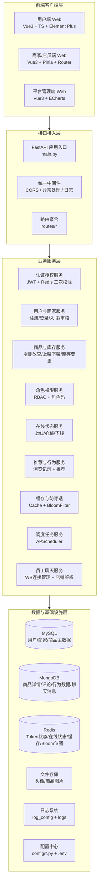

<div align="center">

# 🛒 XB Mall 电商平台


一个现代化的全栈电商平台系统，采用前后端分离架构设计。

</div>

---

## 📁 项目结构

```text
xb_mall/
├── porject/              # 🖥️  前端项目 (Vue.js + Vite)
│   ├── src/              # 源代码
│   ├── public/           # 静态资源
│   ├── node_modules/     # 依赖包
│   ├── package.json      # 项目配置
│   └── ...
├── serve/                # 🔧  后端项目 (FastAPI)
│   ├── main.py           # 主应用入口
│   ├── routes/           # API 路由
│   ├── services/         # 业务逻辑服务
│   ├── data/             # 数据访问层
│   ├── config/           # 配置文件
│   ├── logs/             # 📝 日志目录
│   └── ...
└── README.md             # 📄 项目文档
```

## 🏗️ 系统架构



## ⚙️ 技术栈

<div align="center">

| 技术类别              | 技术选型                                                       | 版本/标准 |
| --------------------- | -------------------------------------------------------------- | --------- |
| **前端框架**    | [Vue.js](https://vuejs.org/)                                      | 3.x       |
| **构建工具**    | [Vite](https://vitejs.dev/)                                       | 最新版    |
| **UI 框架**     | [Element Plus](https://element-plus.org/)                         | 最新版    |
| **状态管理**    | [Pinia](https://pinia.vuejs.org/)                                 | 最新版    |
| **图表库**      | [ECharts](https://echarts.apache.org/)                            | 最新版    |
| **HTTP 客户端** | [Axios](https://axios-http.com/)                                  | 最新版    |
| **后端框架**    | [FastAPI](https://fastapi.tiangolo.com/)                          | 0.104+    |
| **编程语言**    | [Python](https://www.python.org/)                                 | 3.10+     |
| **数据库**      | [MySQL](https://www.mysql.com/), [MongoDB](https://www.mongodb.com/) | 最新版    |
| **缓存**        | [Redis](https://redis.io/)                                        | 最新版    |
| **任务调度**    | [APScheduler](https://apscheduler.readthedocs.io/)                | 最新版    |

</div>

<br>

### 🖥️ 前端技术

- **框架**: Vue.js 3 - 渐进式 JavaScript 框架
- **构建工具**: Vite - 下一代前端构建工具
- **UI 框架**: Element Plus - 企业级组件库
- **状态管理**: Pinia - 轻量级状态管理库
- **图表库**: ECharts - 强大的可视化图表库
- **HTTP 客户端**: Axios - Promise 基于的 HTTP 客户端

### 🔧 后端技术

- **框架**: FastAPI - 现代高性能 Web 框架
- **数据库**: MySQL（关系型）, MongoDB（文档型）
- **缓存**: Redis - 内存数据结构存储
- **任务调度**: APScheduler - Python 任务调度库
- **认证**: JWT Token - 无状态身份验证
- **CORS**: 支持跨域资源共享

## ✨ 核心功能

<div align="center">

| 功能模块           | 功能描述                       | 技术实现           |
| ------------------ | ------------------------------ | ------------------ |
| **用户管理** | 用户注册、登录、密码重置       | JWT Token 认证     |
| **商家管理** | 商家入驻申请、审核、状态管理   | 审核流程自动化     |
| **商品管理** | 商品上架、下架、编辑、库存管理 | 多数据库支持       |
| **店铺管理** | 店铺创建、编辑、个性化设置     | 自定义店铺配置     |
| **权限管理** | 用户角色分配、权限控制         | RBAC 权限模型      |
| **数据统计** | 用户增长、销售数据、商家统计   | ECharts 图表展示   |
| **实时监控** | 用户在线状态、系统健康度       | WebSocket 实时通信 |
| **浏览历史** | 商品浏览记录、历史分页、删除清空 | MongoDB + Redis 缓存 |
| **智能推荐** | 基于用户行为的商品推荐         | Wide & Deep + 增量训练 |
| **购物车**   | 添加、列表、修改数量、删除、清空、结算 | MySQL + 分页 + 模糊搜索 |
| **员工聊天** | 店铺内员工实时群聊、消息持久化、历史记录回溯 | WebSocket + MongoDB |

</div>

<br>

### 🖥️ 前端功能亮点

- 📝 **用户注册/登录** - 安全的身份验证机制
- 🔐 **验证码系统** - 防止机器人攻击
- 🔄 **密码重置** - 安全的密码找回流程
- 👥 **商家管理** - 商家信息管理与审核
- 📦 **商品管理** - 商品信息全生命周期管理
- 🛒 **购物车** - 添加商品、修改数量、删除、清空、勾选合计、结算
- 🏪 **店铺管理** - 店铺个性化配置与管理
- 💬 **员工聊天** - 商家头部导航栏内嵌聊天抽屉，支持店铺内员工实时群聊
- 🔐 **用户权限管理** - 细粒度权限控制
- 👑 **角色分配** - 灵活的角色管理系统

### 🔧 后端功能亮点

- 🔐 **用户认证与授权** - JWT Token 身份验证
- ✅ **商家申请审核** - 自动化审核流程
- 📦 **商品上下架管理** - 商品生命周期管理
- 📊 **库存管理** - 实时库存跟踪
- 🏷️ **分类管理** - 商品分类体系管理
- 👥 **用户在线状态管理** - 实时用户状态监控
- 💾 **数据缓存服务** - 高性能缓存策略
- 👁️ **浏览行为记录** - 登录后浏览商品自动写入 `user_browse_record`
- 🕘 **浏览历史接口** - 支持分页查询、单条删除、全部清空
- 🤖 **智能推荐服务** - 基于浏览/购买行为生成个性化推荐
- 🔁 **增量训练调度** - 每 5 分钟检测新行为并自动训练或重建模型
- 🛒 **购物车服务** - 添加、列表分页、修改数量、删除、清空，支持按商品名模糊搜索
- 💬 **员工聊天服务** - WebSocket 全双工实时通信，按店铺隔离连接，消息持久化至 MongoDB，支持历史回溯

## 🧠 推荐系统

当前项目内置基于用户行为的商品推荐能力，推荐链路如下：

1. 用户登录后访问商品详情，后端异步记录浏览行为。
2. 浏览/购买行为写入 MongoDB `user_browse_record` 集合。
3. 定时任务周期性检查新增行为数据。
4. 若模型文件不存在，则执行一次全量训练。
5. 若词表未变化，则仅对新增行为做增量微调。
6. 若出现新用户、新商品或新类目，则自动切换为全量重建。
7. 训练完成后自动清理推荐缓存，推荐接口下次请求热加载最新模型。

### 模型与产物

- 模型结构：`Wide & Deep`
- 训练数据来源：`user_browse_record`、`shopping`
- 模型目录：`serve/services/recommend/models/wide_deep/`
- 训练产物：
  - `model.pt`
  - `config.json`
  - `vocab.json`
  - `training_state.json`

### 训练触发规则

- 默认每 `5` 分钟运行一次推荐训练检查任务。
- 首次生成模型时，如果训练样本少于 `100` 条，将跳过训练。
- 已有模型后，会优先尝试增量训练；若词表变化则自动全量重建。

### 手动训练

虽然系统已经支持自动增量训练，但仍可手动执行全量训练：

```bash
cd serve
python -m services.recommend.wide_deep.train
```

如果使用 `uv` 管理环境，也可以执行：

```bash
cd serve
uv run python -m services.recommend.wide_deep.train
```

## 🛒 购物车

- 用户登录后可在商品详情页将商品加入购物车。
- 购物车支持分页展示、按商品名模糊搜索、修改数量、单条删除、全部清空。
- 支持勾选商品并显示勾选合计金额，提供结算入口。
- 后端 API：`/api/shopping_cart_add`（添加）、`/api/shopping_cart_list`（列表）、`/api/shopping_cart_update`（修改数量）、`/api/shopping_cart_delete`（删除）、`/api/shopping_cart_clear`（清空）。

## 👀 浏览历史

- 浏览历史数据来自用户在商品详情页的浏览行为记录。
- 历史记录接口返回商品首图的 Base64 数据，前端直接拼接为图片展示。
- 支持最近浏览时间排序、分页读取、单条删除和全部清空。
- 浏览行为变化后会自动失效对应历史缓存与推荐缓存，避免数据陈旧。

## 💬 员工聊天室

商家端（卖家后台）内置了基于 WebSocket 的**店铺内部实时聊天**功能，供同一店铺的员工进行即时沟通。

### 入口

商家端顶部导航栏（`buyer_head.vue`）右上角的聊天图标按钮，点击弹出侧边抽屉即可进入聊天室。

- **主商户（station=1）**：抽屉顶部展示所有店铺的下拉选择器，选择目标店铺后自动连接对应聊天室。
- **店铺员工（station=2）**：页面加载时自动在后台建立连接，收到新消息时导航栏徽标计数 +1，打开抽屉后清零。

### 服务端架构

```text
routes/store_chat/__init__.py          # WebSocket 路由（仅编排，不含业务逻辑）
services/store_chat_manager/__init__.py  # 连接池管理（按 mall_id 隔离）
services/store_chat_auth/__init__.py     # 鉴权服务（复用 VerifyDuterToken）
```

### 鉴权流程

1. 客户端连接时在 query 参数携带 `token`（格式与其他卖家端接口相同）。
2. `StoreChatAuth` 调用 `VerifyDuterToken` 解析 JWT 并验证 Redis 中的过期时间戳。
3. 按 `station` 区分身份：主商户校验 `state_id_list`，店铺员工校验绑定的 `mall_id`。
4. 鉴权失败时以 WebSocket 关闭码 `4001` 断开连接。

### 消息协议

| 方向 | 消息类型 | 结构 |
|---|---|---|
| 服务端 → 客户端 | `history` | `{ "type": "history", "data": [...] }` |
| 服务端 → 客户端 | `chat` | `{ "type": "chat", "username": "...", "content": "...", "created_at": "..." }` |
| 服务端 → 客户端 | `system` | `{ "type": "system", "content": "...", "online_users": [...], "created_at": "..." }` |
| 客户端 → 服务端 | `chat` | `{ "type": "chat", "content": "..." }` |

### 持久化

聊天消息写入 MongoDB `store_employee_chat` 集合，每次新连接时推送最近 **80 条**历史消息。

### WebSocket 端点

```
ws://host/api/ws/store_chat/{mall_id}?token=<buyer_access_token>
```

## 项目维护

- **许可证**: GPLv3
- **作者**: SDIJF1521
- **版本**: 0.4.0

## 🤝贡献指南

欢迎提交 Issue 和 Pull Request 来改进此项目。

## 🙏致谢

感谢所有为本项目做出贡献的人。
