<div align="center">

# 🛒 XB Mall 电商平台


一个现代化的全栈电商平台系统，采用前后端分离架构设计。

</div>

---

## 📁 项目结构

```text
xb_mall/
├── porject/              # 🖥️  前端项目 (Vue.js + Vite)
│   ├── src/              # 源代码
│   ├── public/           # 静态资源
│   ├── node_modules/     # 依赖包
│   ├── package.json      # 项目配置
│   └── ...
├── serve/                # 🔧  后端项目 (FastAPI)
│   ├── main.py           # 主应用入口
│   ├── routes/           # API 路由
│   ├── services/         # 业务逻辑服务（见下方「目录约定」）
│   ├── data/             # 数据访问层
│   ├── config/           # 配置文件（含 `manage_permission_catalog.py` 平台权限码）
│   ├── logs/             # 📝 日志目录
│   └── ...
└── README.md             # 📄 项目文档
```

### `serve/services` 目录约定

- **每个业务模块一个子目录**，入口为 `services/<模块名>/__init__.py`（包形式），例如：`manage_login/`、`manage_rbac/`、`management_token_verify/`、`manage_token_issue/`、`manage_admin_guard/`、`manage_rbac_migrate/`、`order/`、`refund/`、`order_migrate/`。
- **不要在 `services/` 根目录**直接放置与业务模块同名的单文件 `*.py`（避免与包名冲突、便于维护）。
- 复杂子域可在模块下再分子目录（如 `recommend/wide_deep/`）。

## 🚀 快速启动

### 1) 环境准备

- Node.js `>= 18`（前端）
- Python `>= 3.10`（后端）
- MySQL、MongoDB、Redis（本地或远程实例均可）
- 可选：`uv`（推荐，用于 Python 依赖管理）

### 2) 后端配置与启动（FastAPI）

1. 进入后端目录：

```bash
cd serve
```

1. 复制环境变量模板并按需修改：

```bash
cp .env.example .env
```

Windows PowerShell 可用：

```powershell
Copy-Item .env.example .env
```

1. 至少确认以下配置项可用：

- `DB_HOST` `DB_PORT` `DB_USER` `DB_PASSWORD` `DB_NAME`
- `MONGODB_HOST` `MONGODB_PORT` `MONGODB_DATABASE`
- `REDIS_HOST` `REDIS_PORT` `REDIS_DB`
- `JWT_USER_SECRET_KEY` `JWT_CODE_SECRET_KEY` `JWT_ADMIN_SECRET_KEY` `JWT_SELLER_SECRET_KEY`

1. 启动后端（任选一种方式）：

使用 `uv` + FastAPI 开发模式（推荐）：

```bash
uv sync
uv run fastapi dev main.py
```

使用 `uv` + uvicorn：

```bash
uv sync
uv run uvicorn main:app --host 0.0.0.0 --port 8000 --reload
```

使用 `pip`：

```bash
python -m venv .venv
source .venv/bin/activate
pip install -e .
uvicorn main:app --host 0.0.0.0 --port 8000 --reload
```

Windows PowerShell（`pip` 方式激活虚拟环境）：

```powershell
python -m venv .venv
.\.venv\Scripts\Activate.ps1
pip install -e .
uvicorn main:app --host 0.0.0.0 --port 8000 --reload
```

后端默认地址：`http://127.0.0.1:8000`  
接口文档：`http://127.0.0.1:8000/docs`

### 3) 前端安装与启动（Vue3 + Vite）

```bash
cd porject
npm install
npm run dev
```

前端默认地址：`http://127.0.0.1:5173`

### 4) 安全提示

- 建议将 `JWT_*` 等密钥改为你自己的随机强密钥，不要使用默认值。
- 生产环境不要在代码中保留明文邮箱凭证，建议改为环境变量注入。
- 请确保 `.env` 不提交到公开仓库。

## 🏗️ 系统架构

### 整体分层架构

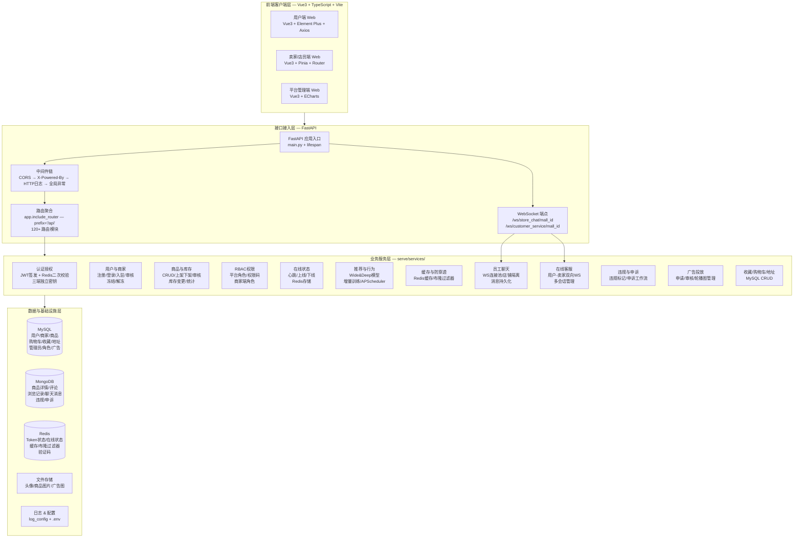

### 三端认证流程

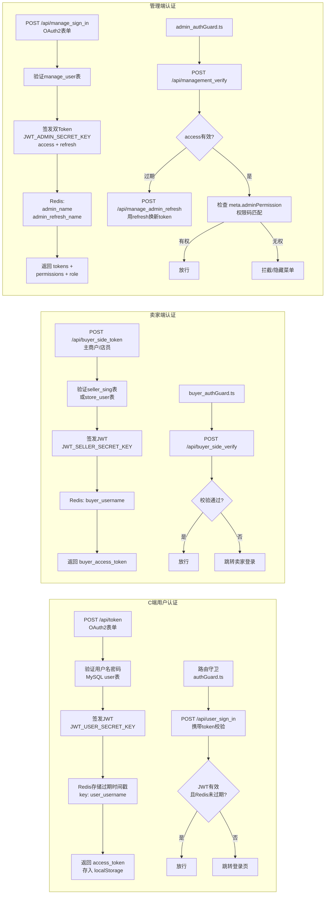

### 用户端（C端）业务流程

```mermaid
flowchart TB
    subgraph Register["注册与登录"]
        R1["访问 /register"] --> R2["填写用户名/密码/邮箱"]
        R2 --> R3["POST /api/verification_code\n发送邮箱验证码"]
        R3 --> R4["POST /api/verify_code\n校验验证码"]
        R4 --> R5["POST /api/register\n创建用户"]
        R5 --> R6["跳转登录页"]
        R6 --> R7["POST /api/token\n获取JWT"]
    end

    subgraph Home["首页与商城"]
        H1["访问首页 /"] --> H2["GET /api/ad_banner_active\n加载轮播图广告"]
        H2 --> H3["GET /api/recommend_commodity_list\n加载推荐商品"]
        H4["访问商城 /mall"] --> H5["GET /api/mall_commodity_search\n模糊搜索 — 名称/描述/标签/店铺\n分页50条 + Redis缓存60s"]
        H5 --> H6["懒加载下一页"]
    end

    subgraph Product["商品与店铺"]
        P1["点击商品"] --> P2["GET /api/commodity_content\n商品详情 — MongoDB"]
        P2 --> P3["已登录? 异步记录浏览行为\n写入MongoDB user_browse_record"]
        P2 --> P4["GET /api/commodity_comments\n评论列表"]
        P2 --> P5["GET /api/favorite_check\n是否已收藏"]
        P2 --> P6["POST /api/shopping_cart_add\n添加购物车"]
        P2 --> P7["POST /api/favorite_add\n收藏商品/店铺"]
        P2 --> P8["打开客服悬浮球\nWebSocket连接"]
        P9["访问店铺页"] --> P10["GET /api/store_info"]
        P10 --> P11["GET /api/store_commodity_list"]
    end

    subgraph Cart["购物车"]
        CT1["GET /api/shopping_cart_list\n分页 + 模糊搜索"] --> CT2["POST /api/shopping_cart_update\n修改数量"]
        CT1 --> CT3["DELETE /api/shopping_cart_delete\n删除"]
        CT1 --> CT4["DELETE /api/shopping_cart_clear\n清空"]
        CT1 --> CT5["勾选合计 → 结算"]
    end

    subgraph Order["订单与支付"]
        OD1["POST /api/order/create\n创建订单（幂等键+扣库存）"]
        OD1 --> OD2["POST /api/order/pay\n发起支付宝支付"]
        OD2 --> OD3["支付宝回调\nalipay_notify\n资金入担保账户"]
        OD3 --> OD4["POST /api/order/confirm\n确认收货 释放担保"]
        OD3 --> OD5["POST /api/refund/apply\n申请退款"]
        OD5 --> OD6["POST /api/refund/dispute\n发起纠纷 平台介入"]
        OD1 --> OD7["POST /api/order/cancel\n取消/超时自动关闭"]
    end

    subgraph Personal["个人中心"]
        PC1["个人资料\nGET/POST user_data"]
        PC2["我的收藏\nGET /api/favorite_list\n分页/类型筛选/模糊搜索"]
        PC3["浏览历史\nbrowsing_history\ndelete/clear"]
        PC4["密码重置\npassword_reset"]
        PC5["地址管理\nadd/get/modify/delete"]
        PC6["客服消息\ncs_user_sessions/history"]
        PC7["商家入驻\napply_seller"]
        PC8["我的订单\norder/list + 状态筛选\n确认收货/申请退款"]
    end

    subgraph Online["在线状态"]
        O1["heartbeatGuard.ts\n登录用户启动心跳"] --> O2["POST /api/online_heartbeat\n定时上报"]
        O2 --> O3["Redis记录在线状态"]
    end
```

### 卖家端业务流程

```mermaid
flowchart TB
    subgraph SellerLogin["卖家登录"]
        SL1["访问 /buyer_side_sing"] --> SL2["POST /api/buyer_side_token\n主商户 station=1: seller_sing表\n店员 station=2: store_user表"]
        SL2 --> SL3["JWT + Redis → buyer_access_token"]
    end

    subgraph StoreManage["店铺管理"]
        SM1["创建店铺\nadd_mall + mall_img_upload"]
        SM2["店铺详情\nbuyer_get_mall_info/name"]
        SM3["更新店铺\nbuyer_update_mall"]
        SM4["删除店铺\nbuyer_delete_show"]
    end

    subgraph StaffManage["员工与角色管理"]
        SF1["员工列表 buyer_mall_user_list"]
        SF2["添加/修改/删除 员工"]
        SF3["角色CRUD\nbuyer_role_add/info/update/delete"]
        SF4["角色统计 buyer_role_ratio"]
    end

    subgraph CommodityManage["商品管理"]
        CM1["新增商品\nbuyer_commoidt_add + 图片上传"]
        CM2["编辑商品\nbuyer_commodity_edit"]
        CM3["上架申请\nbuyer_commoidt_putaway → 平台审核"]
        CM4["下架 buyer_commodity_delisting"]
        CM5["删除 buyer_commodity_delete"]
        CM6["分类管理\nbuyer_classify_add/edit/delete"]
    end

    subgraph InventoryManage["库存管理"]
        IM1["库存列表 repertory_list"]
        IM2["库存变更 inventory_change"]
        IM3["变更记录 list_records"]
        IM4["库存统计 statistics"]
        IM5["全量导出 repertory_all"]
    end

    subgraph ViolationAppeal["违规申诉"]
        VA1["查看违规商品"] --> VA2["POST buyer_commodity_violation_appeal\n提交申诉理由"]
        VA2 --> VA3["MongoDB commodity_appeal\nstatus=pending"]
        VA3 --> VA4["GET buyer_commodity_appeal_status\n查询申诉状态"]
    end

    subgraph SellerDashboard["卖家仪表盘"]
        SD1["GET /seller/dashboard/summary\n数据卡片+饼图+趋势+最近订单"]
        SD2["GET /seller/dashboard/export\n导出营业报表 CSV"]
        SD3["时间范围筛选\nweek/month/three_months/year"]
    end

    subgraph OrderManage["订单与退款管理"]
        OM1["GET /seller/order/list\n订单列表 状态/关键词筛选"]
        OM2["GET /seller/order/escrow_list\n资金明细（担保账户）"]
        OM3["GET /seller/order/refund_list\n退款申请列表"]
        OM4["POST /seller/order/refund_review\n退款审核（同意/拒绝）"]
    end

    subgraph AdApply["广告投放"]
        AD1["POST buyer_ad_apply\n选择商品+标题+描述+天数+广告图"]
        AD2["GET buyer_ad_apply_list\n我的申请记录"]
    end

    subgraph StoreChat["员工聊天"]
        SC1["WebSocket\n/ws/store_chat/mall_id"] --> SC2["StoreChatAuth 鉴权"]
        SC2 --> SC3["连接池按mall_id隔离"]
        SC3 --> SC4["MongoDB store_employee_chat\n入群推送80条历史"]
    end

    subgraph CustomerServiceSeller["客服管理"]
        CS1["WebSocket\n/ws/customer_service/mall_id\nclient_type=seller"]
        CS2["左侧会话列表 session_list"]
        CS3["右侧聊天窗口 回复消息"]
        CS4["GET cs_seller_total_unread\n导航未读徽章"]
    end
```

### 平台管理端业务流程

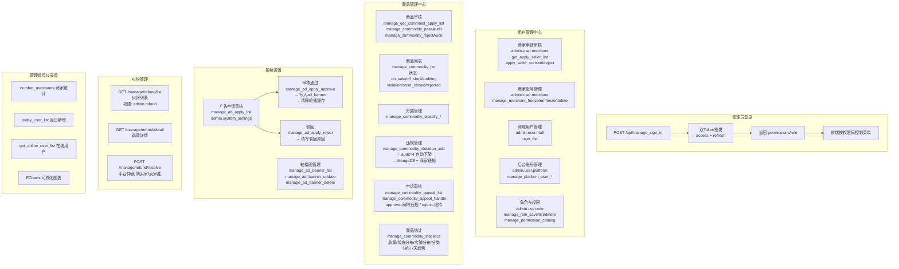

### 实时通信架构（WebSocket）

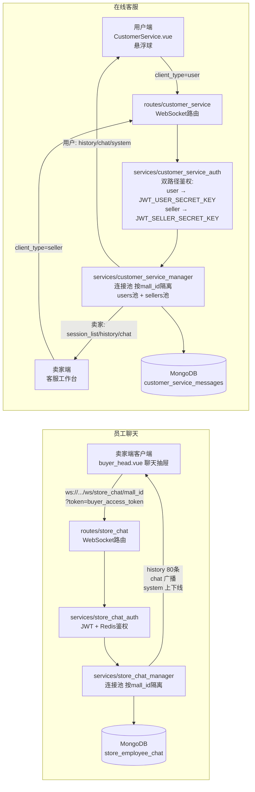

### 推荐系统流程

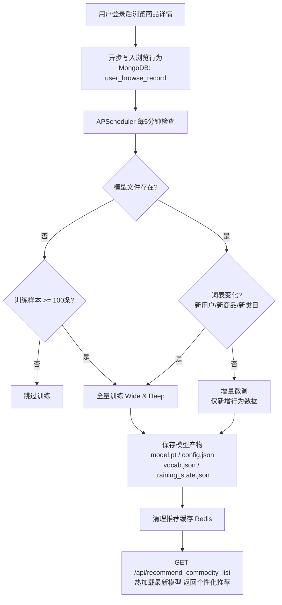

### 商品生命周期状态流转

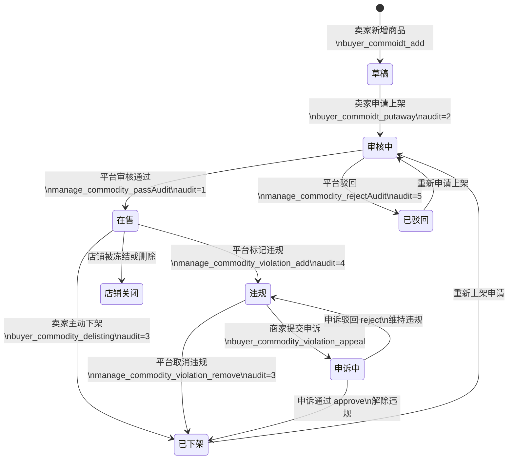

### 广告投放完整流程

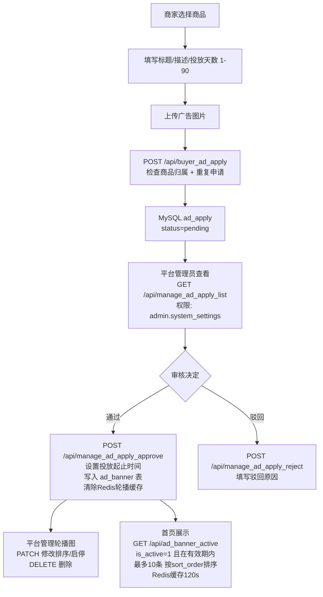

### 数据层架构

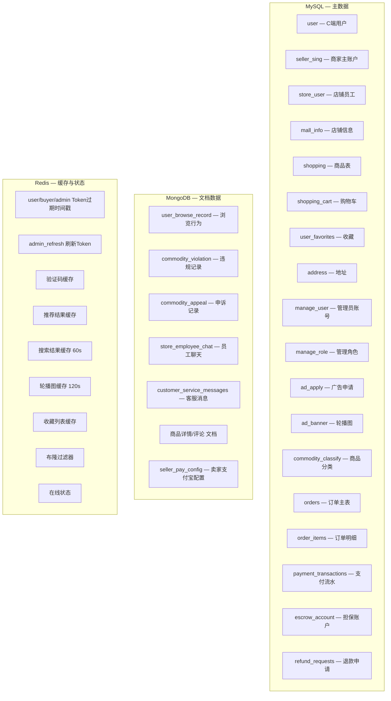

## ⚙️ 技术栈

<div align="center">

| 技术类别              | 技术选型                                                       | 版本/标准 |
| --------------------- | -------------------------------------------------------------- | --------- |
| **前端框架**    | [Vue.js](https://vuejs.org/)                                      | 3.x       |
| **构建工具**    | [Vite](https://vitejs.dev/)                                       | 最新版    |
| **UI 框架**     | [Element Plus](https://element-plus.org/)                         | 最新版    |
| **状态管理**    | [Pinia](https://pinia.vuejs.org/)                                 | 最新版    |
| **图表库**      | [ECharts](https://echarts.apache.org/)                            | 最新版    |
| **HTTP 客户端** | [Axios](https://axios-http.com/)                                  | 最新版    |
| **后端框架**    | [FastAPI](https://fastapi.tiangolo.com/)                          | 0.104+    |
| **编程语言**    | [Python](https://www.python.org/)                                 | 3.10+     |
| **数据库**      | [MySQL](https://www.mysql.com/), [MongoDB](https://www.mongodb.com/) | 最新版    |
| **缓存**        | [Redis](https://redis.io/)                                        | 最新版    |
| **任务调度**    | [APScheduler](https://apscheduler.readthedocs.io/)                | 最新版    |

</div>

<br>

### 🖥️ 前端技术

- **框架**: Vue.js 3 - 渐进式 JavaScript 框架
- **构建工具**: Vite - 下一代前端构建工具
- **UI 框架**: Element Plus - 企业级组件库
- **状态管理**: Pinia - 轻量级状态管理库
- **图表库**: ECharts - 强大的可视化图表库
- **HTTP 客户端**: Axios - Promise 基于的 HTTP 客户端

### 🔧 后端技术

- **框架**: FastAPI - 现代高性能 Web 框架
- **数据库**: MySQL（关系型）, MongoDB（文档型）
- **缓存**: Redis - 内存数据结构存储
- **任务调度**: APScheduler - Python 任务调度库
- **认证**: JWT Token - 无状态身份验证
- **CORS**: 支持跨域资源共享

## ✨ 核心功能

<div align="center">

| 功能模块           | 功能描述                       | 技术实现           |
| ------------------ | ------------------------------ | ------------------ |
| **用户管理** | 用户注册、登录、密码重置       | JWT Token 认证     |
| **商家管理** | 商家入驻申请、审核、状态管理   | 审核流程自动化     |
| **商品管理** | 商品上架、下架、编辑、库存管理 | 多数据库支持       |
| **店铺管理** | 店铺创建、编辑、个性化设置     | 自定义店铺配置     |
| **权限管理** | 用户角色分配、权限控制         | RBAC 权限模型      |
| **数据统计** | 用户增长、销售数据、商家统计   | ECharts 图表展示   |
| **实时监控** | 用户在线状态、系统健康度       | WebSocket 实时通信 |
| **浏览历史** | 商品浏览记录、历史分页、删除清空 | MongoDB + Redis 缓存 |
| **智能推荐** | 基于用户行为的商品推荐         | Wide & Deep + 增量训练 |
| **购物车**   | 添加、列表、修改数量、删除、清空、结算 | MySQL + 分页 + 模糊搜索 |
| **收藏夹**   | 收藏商品/店铺、列表分页与搜索、取消收藏 | MySQL `user_favorites` + Redis 缓存失效 |
| **员工聊天** | 店铺内员工实时群聊、消息持久化、历史记录回溯 | WebSocket + MongoDB |
| **在线客服** | 用户悬浮聊天窗口、商品卡片发送、卖家多会话管理 | WebSocket + MongoDB |
| **平台商品管理** | 商品列表、状态筛选、店铺筛选、搜索 | 多状态流转 + 分页 |
| **平台分类管理** | 平台级分类增删改查 | MySQL + 分页搜索 |
| **商品统计** | 商品总量、各状态分布、店铺分布、分类分布、近 7 天趋势 | ECharts 可视化 |
| **违规管理** | 商品违规标记、取消违规、违规列表 | 违规通知 + 状态流转 |
| **申诉系统** | 商家违规申诉提交、平台审核通过/驳回 | 完整申诉工作流 |
| **订单系统** | 下单、支付（支付宝）、超时关闭、确认收货、退款 | 乐观锁 + 幂等性 + 担保交易 |
| **退款与纠纷** | 买家申请退款、卖家审核、平台仲裁、支付宝原路退款 | 多级审核流 + 支付宝 API |
| **卖家仪表盘** | 数据卡片、订单状态分布、销售趋势、最近订单、营业报表导出 | ECharts + CSV 导出 |
| **卖家订单管理** | 订单列表、资金明细、退款审核 | MySQL orders/escrow_account |
| **平台纠纷管理** | 纠纷列表、退款详情、平台仲裁 | 权限码 `admin.refund` |
| **平台 RBAC** | 后台账号、角色、权限、商城用户 | manage_user/role + 权限码 |
| **广告投放** | 商家申请轮播图广告、平台审核、首页轮播展示 | MySQL ad_apply/ad_banner + Redis 缓存 |
| **平台系统设置** | 广告设置、轮播图管理、申请审核（后续扩展商城/活动/系统配置） | 权限码 `admin.system_settings` |

</div>

<br>

### 🖥️ 前端功能亮点

- 📝 **用户注册/登录** - 安全的身份验证机制
- 🔐 **验证码系统** - 防止机器人攻击
- 🔄 **密码重置** - 安全的密码找回流程
- 👥 **商家管理** - 商家信息管理与审核
- 📦 **商品管理** - 商品信息全生命周期管理
- 🛒 **购物车** - 添加商品、修改数量、删除、清空、勾选合计、结算
- ❤️ **收藏** - 商品详情页与店铺页支持收藏/取消；个人中心「我的收藏」分页展示、按名称模糊搜索、按类型筛选（商品/店铺）
- 🔍 **商城搜索** - 模糊匹配商品名称、描述、标签、店铺名称，分页默认 50 条，懒加载优化性能
- 🏪 **店铺管理** - 店铺个性化配置与管理
- 💬 **员工聊天** - 商家头部导航栏内嵌聊天抽屉，支持店铺内员工实时群聊
- 🎧 **在线客服（用户端）** - 商品详情页及店铺页，支持文本消息和商品卡片一键发送，未读消息徽标计数；个人主页新增「客服消息」页面，可查看与各店铺的交流记录
- 🛎️ **在线客服（卖家端）** - 多会话列表 + 聊天窗口，支持实时回复、历史记录拉取、断线自动重连；左侧导航「客服管理」菜单显示未读消息徽章
- 🔐 **用户权限管理** - 细粒度权限控制（基于 RBAC 权限码）
- 👑 **角色分配** - 灵活的角色管理系统
- 📋 **平台用户中心** - 商家申请、商家账号、商城用户、后台账号、角色与权限（按权限显示菜单）
- 📋 **平台商品列表** - 支持多状态筛选（在售/下架/审核中/违规/店铺关闭/已驳回）、店铺筛选、搜索、分页
- 📊 **商品数据统计** - 商品总量、各状态数量、店铺分布、分类分布、近 7 天趋势图表
- 🏷️ **平台分类管理** - 平台级商品分类增删改查、分页搜索
- 🚫 **违规商品管理** - 违规标记、取消违规、违规列表查看
- 📮 **申诉审核** - 商家提交违规申诉、平台审核通过/驳回、申诉状态查询
- 📢 **广告投放申请（商家端）** - 商家在「广告投放管理」页面选择商品、填写标题/描述/投放天数并上传广告图，提交后等待平台审核；历史申请列表支持状态筛选（待审核/已通过/已驳回）
- 🖼️ **平台系统设置** - 管理端新增「系统设置」页（路由 `/management_system_settings`），目前已实现「广告设置」子页：轮播图管理（启停、排序、删除）、广告申请审核（通过/驳回并填写驳回原因）
- 📊 **卖家仪表盘** - 数据卡片（商品数/订单数/销售额/待处理退款）、饼图（订单状态分布）、折线图（销售趋势）、最近订单表格，支持按周/月/季/年筛选；营业报表一键导出 CSV
- 📝 **卖家订单管理** - 订单列表（状态筛选 + 关键词搜索 + 分页）、资金明细（担保账户流水）、退款申请列表及审核（同意/拒绝）
- 🛍️ **买家订单** - 个人中心「我的订单」页面，展示用户全部订单，支持状态筛选、确认收货、申请退款、查看物流
- ⚖️ **平台纠纷管理** - 平台管理端纠纷列表、退款详情查看、平台仲裁处理（权限码 `admin.refund`）

### 🔧 后端功能亮点

- 🔐 **用户认证与授权** - JWT Token 身份验证
- ✅ **商家申请审核** - 自动化审核流程
- 📦 **商品上下架管理** - 商品生命周期管理
- 📊 **库存管理** - 实时库存跟踪
- 🏷️ **分类管理** - 商品分类体系管理
- 👥 **用户在线状态管理** - 实时用户状态监控
- 💾 **数据缓存服务** - 高性能缓存策略
- 👁️ **浏览行为记录** - 登录后浏览商品自动写入 `user_browse_record`
- 🕘 **浏览历史接口** - 支持分页查询、单条删除、全部清空
- 🤖 **智能推荐服务** - 基于浏览/购买行为生成个性化推荐
- 🔁 **增量训练调度** - 每 5 分钟检测新行为并自动训练或重建模型
- 🛒 **购物车服务** - 添加、列表分页、修改数量、删除、清空，支持按商品名模糊搜索
- ❤️ **收藏服务** - `POST /api/favorite_add`（商品 `commodity` / 店铺 `store`）、`GET /api/favorite_list`（分页、类型筛选、`search` 模糊匹配名称）、`DELETE /api/favorite_remove`（`id` 查询参数）、`GET /api/favorite_check`（是否已收藏）；数据表 `user_favorites`，操作后失效用户收藏列表缓存
- 🔍 **商城商品搜索** - GET `/api/mall_commodity_search`，模糊匹配名称、描述、标签、店铺名称（任一符合即可），分页默认 50 条，Redis 缓存 60 秒
- 💬 **员工聊天服务** - WebSocket 全双工实时通信，按店铺隔离连接，消息持久化至 MongoDB，支持历史回溯
- 🎧 **在线客服服务** - 用户端与卖家端双向 WebSocket 通信，按 `mall_id` 隔离连接池，消息持久化至 MongoDB `customer_service_messages` 集合，支持商品卡片消息类型，会话历史推送最近 80 条
- 📬 **客服消息 HTTP 接口** - `GET /api/cs_user_sessions` 用户会话列表、`GET /api/cs_user_history` 消息历史、`GET /api/cs_unread_count` 未读数、`POST /api/cs_mark_read` 标记已读、`GET /api/cs_seller_total_unread` 卖家未读总数、`GET /api/cs_seller_store_unreads` 各店铺未读数；支持精确定位未读消息
- 📋 **平台商品管理服务** - `GET /api/manage_commodity_list` 商品列表（支持状态筛选：on_sale/off_shelf/auditing/violation/store_closed/rejected）、`GET /api/manage_commodity_statistics` 商品统计
- 🏷️ **平台分类管理服务** - `POST /api/manage_commodity_classify_add` 新增、`POST /api/manage_commodity_classify_edit` 编辑、`POST /api/manage_commodity_classify_delete` 删除、`GET /api/manage_commodity_classify_list` 列表
- 🚫 **违规管理服务** - `POST /api/manage_commodity_violation_add` 标记违规、`POST /api/manage_commodity_violation_remove` 取消违规、`GET /api/manage_commodity_violation_list` 违规列表
- 📮 **申诉管理服务** - `GET /api/manage_commodity_appeal_list` 申诉列表、`POST /api/manage_commodity_appeal_handle` 审核处理（approve/reject）、`POST /api/buyer_commodity_violation_appeal` 商家提交申诉、`GET /api/buyer_commodity_appeal_status` 申诉状态查询
- 📦 **订单服务** - `POST /api/order/create` 创建订单（含库存扣减 + 乐观锁）、`GET /api/order/list` 买家订单列表、`POST /api/order/confirm` 确认收货、`POST /api/order/cancel` 取消订单、幂等号防重复提交；数据表 `orders` + `order_items`
- 💳 **支付服务** - 支付宝网页支付 `POST /api/order/pay`、支付回调 `POST /api/order/alipay_notify`、担保账户 `escrow_account`、支付流水 `payment_transactions`；订单超时自动关闭 + 库存回滚
- 🔄 **退款服务** - `POST /api/refund/create` 买家申请退款、`GET /api/refund/detail` 退款详情、`POST /api/seller/order/refund_review` 卖家审核退款、`POST /api/manage_refund/arbitrate` 平台仲裁；支付宝原路退款 + 担保资金释放
- 📊 **卖家仪表盘服务** - `GET /api/seller/dashboard/summary` 聚合仪表盘数据（卡片/饼图/趋势/最近订单）、`GET /api/seller/dashboard/export` 导出营业报表 CSV；支持 week/month/three_months/year 时间范围筛选
- 🔑 **平台 RBAC 服务** - 见上文「平台用户管理（RBAC）」：`manage_sign_in` / `manage_admin_refresh` / `manage_session`、`manage_platform_user_*`、`manage_role_*`、`manage_permission_catalog`；实现位于 `services/manage_*` 包
- 📢 **广告投放服务**：
  - 商家端提交申请：`POST /api/buyer_ad_apply`（表单：`token`、`stroe_id`、`shopping_id`、`title`、`description`、`duration_days`、`ad_img`）；检查商品归属与重复申请
  - 商家端申请列表：`GET /api/buyer_ad_apply_list`（分页、状态筛选）
  - 广告申请图片：`GET /api/buyer_ad_apply_img`
  - 平台申请列表：`GET /api/manage_ad_apply_list`（分页、状态筛选、搜索；需权限 `admin.system_settings`）
  - 平台审核通过：`POST /api/manage_ad_apply_approve`（写入 `ad_banner` 表，设置投放起止时间；清除轮播图缓存）
  - 平台驳回申请：`POST /api/manage_ad_apply_reject`（需填写驳回原因）
  - 轮播图管理列表：`GET /api/manage_ad_banner_list`（分页、启用状态筛选）
  - 更新轮播图：`PATCH /api/manage_ad_banner_update`（更新排序 `sort_order` 或启用状态 `is_active`；清除轮播图缓存）
  - 删除轮播图：`DELETE /api/manage_ad_banner_delete`（清除轮播图缓存）
  - 公共接口（首页轮播）：`GET /api/ad_banner_active`（返回当前生效（启用且在投放期内）的轮播图，最多 10 条，按 `sort_order` 排序，Redis 缓存 120 秒）
  - 数据库迁移：`services/ad_migrate/` 在应用启动时自动建立 `ad_apply` 与 `ad_banner` 表

## 🧠 推荐系统

当前项目内置基于用户行为的商品推荐能力，推荐链路如下：

1. 用户登录后访问商品详情，后端异步记录浏览行为。
2. 浏览/购买行为写入 MongoDB `user_browse_record` 集合。
3. 定时任务周期性检查新增行为数据。
4. 若模型文件不存在，则执行一次全量训练。
5. 若词表未变化，则仅对新增行为做增量微调。
6. 若出现新用户、新商品或新类目，则自动切换为全量重建。
7. 训练完成后自动清理推荐缓存，推荐接口下次请求热加载最新模型。

### 模型与产物

- 模型结构：`Wide & Deep`
- 训练数据来源：`user_browse_record`、`shopping`
- 模型目录：`serve/services/recommend/models/wide_deep/`
- 训练产物：
  - `model.pt`
  - `config.json`
  - `vocab.json`
  - `training_state.json`

### 训练触发规则

- 默认每 `5` 分钟运行一次推荐训练检查任务。
- 首次生成模型时，如果训练样本少于 `100` 条，将跳过训练。
- 已有模型后，会优先尝试增量训练；若词表变化则自动全量重建。

### 手动训练

虽然系统已经支持自动增量训练，但仍可手动执行全量训练：

```bash
cd serve
python -m services.recommend.wide_deep.train
```

如果使用 `uv` 管理环境，也可以执行：

```bash
cd serve
uv run python -m services.recommend.wide_deep.train
```

## 🔍 商城搜索

- 商城页（`/mall`）顶部搜索框支持模糊搜索，匹配商品名称、描述、标签、店铺名称，任一符合即展示。
- 搜索接口：`GET /api/mall_commodity_search`，参数：`keyword`（搜索关键词）、`page`（页码，默认 1）、`page_size`（每页条数，默认 50）。
- 搜索模式采用懒加载：滚动到底部自动加载下一页，无需点击分页。
- 无搜索关键词时展示推荐商品列表（分页模式）。

## 🛒 购物车

- 用户登录后可在商品详情页将商品加入购物车。
- 购物车支持分页展示、按商品名模糊搜索、修改数量、单条删除、全部清空。
- 支持勾选商品并显示勾选合计金额，提供结算入口。
- 后端 API：`/api/shopping_cart_add`（添加）、`/api/shopping_cart_list`（列表）、`/api/shopping_cart_update`（修改数量）、`/api/shopping_cart_delete`（删除）、`/api/shopping_cart_clear`（清空）。

## ❤️ 收藏

登录用户可收藏**在售商品**（`audit=1`）或**正常营业店铺**（`state=1` 且 `state_platform=1`），数据持久化在 MySQL 表 `user_favorites`，列表项附带商品首图 / 店铺封面的 Base64（与浏览历史类似的图片加载方式）。

### 行为说明

- **添加**：`POST /api/favorite_add`，请求体 JSON：`type`（`commodity` | `store`）、`mall_id`、收藏商品时必填 `shopping_id`；请求头 `access-token`。重复收藏返回 `409`。
- **列表**：`GET /api/favorite_list`，查询参数：`type`（可选，`commodity` / `store`）、`page`（默认 1）、`page_size`（默认 10，最大 50）、`search`（可选，按保存的名称模糊匹配）。
- **取消**：`DELETE /api/favorite_remove?id=<收藏记录ID>`。
- **是否已收藏**：`GET /api/favorite_check?type=...&mall_id=...`，收藏商品时需传 `shopping_id`；返回 `is_favorited`、`favorite_id`（已收藏时）。

## 👀 浏览历史

- 浏览历史数据来自用户在商品详情页的浏览行为记录。
- 历史记录接口返回商品首图的 Base64 数据，前端直接拼接为图片展示。
- 支持最近浏览时间排序、分页读取、单条删除和全部清空。
- 浏览行为变化后会自动失效对应历史缓存与推荐缓存，避免数据陈旧。

## 📋 平台商品管理

平台管理端新增完整的**商品管理中心**，包含六大子模块，路由入口为 `/management_commodity`。

### 子模块概览

| 模块 | 页面 | 功能描述 |
|------|------|---------|
| **商品审核** | `commodity_audit.vue` | 审核商家提交的新商品，支持通过/驳回 |
| **商品列表** | `commodity_list.vue` | 全平台商品列表，支持状态筛选（在售/下架/审核中/违规/店铺关闭/已驳回）、店铺筛选、搜索 |
| **商品分类** | `commodity_classify.vue` | 平台级商品分类的增删改查 |
| **违规商品** | `commodity_violation.vue` | 查看违规商品列表、标记违规、取消违规 |
| **申诉审核** | `commodity_appeal.vue` | 审核商家提交的违规申诉，支持通过/驳回 |
| **商品统计** | `commodity_statistics.vue` | 商品数据可视化看板：总量、各状态分布、店铺分布、分类分布、近 7 天趋势 |

### API 端点

| 接口 | 方法 | 路径 | 说明 |
|------|------|------|------|
| 商品列表 | GET | `/api/manage_commodity_list` | 分页、搜索、状态/店铺筛选 |
| 商品统计 | GET | `/api/manage_commodity_statistics` | 统计总量、分布、趋势 |
| 分类列表 | GET | `/api/manage_commodity_classify_list` | 分页搜索 |
| 添加分类 | POST | `/api/manage_commodity_classify_add` | 新增平台级分类 |
| 编辑分类 | POST | `/api/manage_commodity_classify_edit` | 修改分类名称 |
| 删除分类 | POST | `/api/manage_commodity_classify_delete` | 删除分类 |

## 🚫 违规与申诉系统

平台可对违规商品进行标记处理，商家可对违规判定提出申诉，平台审核后决定是否解除违规。

### 违规流程

1. 平台在商品列表中标记某商品为**违规**（`audit=4`），商品自动下架。
2. 违规记录写入 MongoDB `commodity_violation` 集合，同时向商家发送通知。
3. 平台可在违规列表中查看所有违规商品，也可**取消违规**恢复为已下架状态（`audit=3`）。

### 申诉流程

1. 商家在卖家端查看被违规的商品，点击**申诉**按钮填写申诉理由。
2. 申诉记录写入 MongoDB `commodity_appeal` 集合，状态为 `pending`。
3. 平台在申诉审核页查看待处理申诉（支持按状态筛选：pending/approved/rejected）。
4. 审核通过（`approve`）：违规标记自动解除，商品恢复为已下架；审核驳回（`reject`）：商品保持违规状态。

### API 端点

| 接口 | 方法 | 路径 | 说明 |
|------|------|------|------|
| 标记违规 | POST | `/api/manage_commodity_violation_add` | 平台标记商品违规 |
| 违规列表 | GET | `/api/manage_commodity_violation_list` | 分页搜索违规商品 |
| 取消违规 | POST | `/api/manage_commodity_violation_remove` | 恢复商品为下架状态 |
| 申诉列表 | GET | `/api/manage_commodity_appeal_list` | 平台查看申诉（按状态筛选） |
| 处理申诉 | POST | `/api/manage_commodity_appeal_handle` | 通过或驳回申诉 |
| 提交申诉 | POST | `/api/buyer_commodity_violation_appeal` | 商家提交违规申诉 |
| 申诉状态 | GET | `/api/buyer_commodity_appeal_status` | 商家查询申诉状态 |

## 📌 平台用户管理（RBAC）

平台管理端「用户管理」中心（路由 `/user_management`）包含商家申请、商家账号、商城用户、后台账号、角色与权限等子模块；**顶部导航与路由**按权限码控制（前端 `porject/src/utils/adminPermission.ts` 与路由 `meta`）。

### 登录与 Token

- **登录**：`POST /api/manage_sign_in`（OAuth2 表单：`username` / `password`），成功返回 `access_token`、`refresh_token`（及兼容字段 `token`）、`permissions`、`role_id`、`role_name`。
- **校验**：`POST /api/management_verify`（表单 `token`，可为 `Bearer <jwt>` 或纯 JWT）。
- **刷新**：`POST /api/manage_admin_refresh`（JSON：`refresh_token`），返回新 `access_token` / `refresh_token` 及最新 `permissions`。
- **会话**：`GET /api/manage_session`，请求头 `access-token`（与多数平台接口一致）。
- **Redis**：`admin_{用户名}` 存 access 过期时间戳；`admin_refresh_{用户名}` 存 refresh 会话标识。

### 子模块概览

| 模块 | 权限码 | 功能描述 |
|------|--------|---------|
| **商家申请合验** | `admin.user.merchant` | 商家入驻申请列表、跳转审核 |
| **商家账号管理** | `admin.user.merchant` | 商家列表与详情（冻结/解冻/删除等） |
| **商城用户管理** | `admin.user.mall` | 商城 C 端注册用户列表 |
| **后台账号** | `admin.user.platform` | 后台账号列表、新增、删除、改密、分配角色 |
| **角色与权限** | `admin.user.role` | 角色增删改、预定义权限勾选 + 自定义权限码（每行一个）；超级管理员角色 `*` 表示全部权限 |

### 账号规则（与管理员登录页一致）

- **用户名**：长度 3～20 字符。  
- **密码**：长度 6～20 字符。  
- 前后端校验见 `data_mods` 中 `ManagePlatformUserAdd` / `ManagePlatformUserPassword` 与前端 `user_management` 表单。

### 权限目录

预定义权限码位于 `serve/config/manage_permission_catalog.py`：

| 权限码 | 名称 | 分类 |
|--------|------|------|
| `admin.dashboard` | 仪表盘 | 概览 |
| `admin.commodity` | 商品管理 | 商品 |
| `admin.commodity_apply` | 商品审核（申请页） | 商品 |
| `admin.user.merchant` | 商家与申请 | 用户 |
| `admin.user.mall` | 商城用户列表 | 用户 |
| `admin.user.platform` | 后台账号管理 | 用户 |
| `admin.user.role` | 角色与权限配置 | 用户 |
| `admin.audit_seller` | 商家申请审核页 | 审核 |
| `admin.business` | 商家详情 | 商家 |
| `admin.refund` | 纠纷管理 | 运营 |
| `admin.system_settings` | 系统设置 | 设置 |
| `admin.pay_config` | 支付配置 | 设置 |

角色表 `manage_role.permissions` 为 JSON 数组；可包含 `*`（超级管理员全部权限）或上述任意字符串，**自定义权限码**也可写入（角色编辑里文本框逐行添加）。

### 相关服务模块（`serve/services/`）

| 模块 | 说明 |
|------|------|
| `manage_login/` | 管理员登录校验 |
| `manage_token_issue/` | 签发 access / refresh Token |
| `management_token_verify/` | 平台 JWT 与 Redis 校验 |
| `manage_rbac/` | 解析角色权限、权限匹配 |
| `manage_admin_guard/` | 路由层「登录 + 权限码」校验 |
| `manage_rbac_migrate/` | 启动时建表/迁移（`manage_role`、`manage_user.role_id`） |

### API 端点

| 接口 | 方法 | 路径 | 说明 |
|------|------|------|------|
| 管理员登录 | POST | `/api/manage_sign_in` | 返回双 Token 与权限信息 |
| Token 验证 | POST | `/api/management_verify` | 表单 `token` |
| Token 刷新 | POST | `/api/manage_admin_refresh` | JSON：`refresh_token` |
| 会话信息 | GET | `/api/manage_session` | 当前用户与权限 |
| 平台用户列表 | GET | `/api/manage_platform_user_list` | 后台账号列表（含角色） |
| 添加平台用户 | POST | `/api/manage_platform_user_add` | 新增后台管理员 |
| 删除平台用户 | POST | `/api/manage_platform_user_delete` | 删除后台账号 |
| 重置密码 | POST | `/api/manage_platform_user_password` | 重置指定用户密码 |
| 分配角色 | POST | `/api/manage_platform_user_role` | 为用户绑定角色 |
| 权限目录 | GET | `/api/manage_permission_catalog` | 获取可配置的权限码列表 |
| 角色列表 | GET | `/api/manage_role_list` | 角色列表 |
| 角色保存 | POST | `/api/manage_role_save` | 新增/编辑角色（含权限 JSON） |
| 角色删除 | POST | `/api/manage_role_delete` | 删除角色 |

### 数据库与启动

首次启动时 **`services.manage_rbac_migrate.run_manage_rbac_migration`** 会在 `main` 生命周期中执行：创建 `manage_role` 表、为 `manage_user` 增加 `role_id`、写入 id=1 的超级管理员角色（`JSON_ARRAY('*')`），并将已有 `manage_user.role_id` 空值置为 1。

## 💬 员工聊天室

商家端（卖家后台）内置了基于 WebSocket 的**店铺内部实时聊天**功能，供同一店铺的员工进行即时沟通。

### 入口

商家端顶部导航栏（`buyer_head.vue`）右上角的聊天图标按钮，点击弹出侧边抽屉即可进入聊天室。

- **主商户（station=1）**：抽屉顶部展示所有店铺的下拉选择器，选择目标店铺后自动连接对应聊天室。
- **店铺员工（station=2）**：页面加载时自动在后台建立连接，收到新消息时导航栏徽标计数 +1，打开抽屉后清零。

### 服务端架构

```text
routes/store_chat/__init__.py          # WebSocket 路由（仅编排，不含业务逻辑）
services/store_chat_manager/__init__.py  # 连接池管理（按 mall_id 隔离）
services/store_chat_auth/__init__.py     # 鉴权服务（复用 VerifyDuterToken）
```

### 鉴权流程

1. 客户端连接时在 query 参数携带 `token`（格式与其他卖家端接口相同）。
2. `StoreChatAuth` 调用 `VerifyDuterToken` 解析 JWT 并验证 Redis 中的过期时间戳。
3. 按 `station` 区分身份：主商户校验 `state_id_list`，店铺员工校验绑定的 `mall_id`。
4. 鉴权失败时以 WebSocket 关闭码 `4001` 断开连接。

### 消息协议

| 方向 | 消息类型 | 结构 |
|---|---|---|
| 服务端 → 客户端 | `history` | `{ "type": "history", "data": [...] }` |
| 服务端 → 客户端 | `chat` | `{ "type": "chat", "username": "...", "content": "...", "created_at": "..." }` |
| 服务端 → 客户端 | `system` | `{ "type": "system", "content": "...", "online_users": [...], "created_at": "..." }` |
| 客户端 → 服务端 | `chat` | `{ "type": "chat", "content": "..." }` |

### 持久化

聊天消息写入 MongoDB `store_employee_chat` 集合，每次新连接时推送最近 **80 条**历史消息。

### WebSocket 端点

```
ws://host/api/ws/store_chat/{mall_id}?token=<buyer_access_token>
```

## 🎧 在线客服系统

买家端（用户前台）与商家端（卖家后台）均集成了基于 WebSocket 的**在线客服**功能，支持用户与客服人员实时沟通。

### 用户端入口

商品详情页及店铺主页右下角固定悬浮球（`moon/CustomerService.vue`），点击弹出聊天面板。

- 首次点击时自动建立 WebSocket 连接，连接前检测登录状态。
- 面板底部展示当前商品的快捷发送栏，可选择规格后一键发送**商品卡片**至会话。
- 客服回复新消息时，若面板处于收起状态，悬浮球显示未读消息数徽标；页面加载时从 API 拉取该店铺未读数。
- 断线后自动 4 秒重连，可手动点击重连按钮。
- 个人主页「客服消息」菜单可查看与各店铺的交流记录，支持展开查看历史、跳转店铺继续咨询，菜单项显示未读徽章。

### 卖家端入口

商家端左侧导航栏新增**客服管理**菜单，路由为 `/buyer_cs_select`；当有用户发送未读消息时，菜单项显示红色徽章计数。

1. **店铺选择页**（`BuyerCsSelect.vue`）：以卡片网格展示卖家所有店铺，含店铺封面、营业状态，点击「进入客服管理」跳转至对应店铺的客服工作台。
2. **客服工作台**（`BuyerCustomerService.vue`，路由 `/buyer_customer_service/:mall_id`）：
   - 左侧会话列表：展示所有历史对话用户，在线用户以绿色徽标标识，显示最后一条消息和时间。
   - 右侧聊天窗口：点击左侧会话后加载历史记录，支持回复文本消息，消息长度限制 500 字。
   - 顶部实时展示 WebSocket 连接状态，支持手动重连。

### 服务端架构

```text
routes/customer_service/__init__.py          # WebSocket 路由（仅编排，不含业务逻辑）
services/customer_service_manager/__init__.py  # 连接池管理（按 mall_id 隔离 users / sellers）
services/customer_service_auth/__init__.py     # 鉴权服务（用户端 / 卖家端双路径校验）
```

### 鉴权流程

| 身份 | Token 类型 | 校验内容 |
|---|---|---|
| 用户（`client_type=user`） | 普通用户 JWT（`JWT_USER_SECRET_KEY`） | 解析 payload，获取用户名，无需绑定店铺 |
| 主商户（`station=1`） | 商户端 JWT（`JWT_SELLER_SECRET_KEY`） | 校验 `state_id_list` 包含目标 `mall_id` |
| 店铺员工（`station=2`） | 商户端 JWT（`JWT_SELLER_SECRET_KEY`） | 校验 token 绑定的 `mall_id` 一致 |

鉴权失败时以 WebSocket 关闭码 `4001` 断开连接。

### 消息协议

| 方向 | 消息类型 | 结构 |
|---|---|---|
| 服务端 → 用户端 | `history` | `{ "type": "history", "data": [...] }` |
| 服务端 → 用户端 | `chat` | `{ "type": "chat", "sender_type": "seller", "content": "...", ... }` |
| 服务端 → 用户端 | `system` | `{ "type": "system", "content": "...", "created_at": "..." }` |
| 服务端 → 卖家端 | `session_list` | `{ "type": "session_list", "data": [{session_id, online, last_message, last_time}] }` |
| 服务端 → 卖家端 | `history` | `{ "type": "history", "session_id": "...", "data": [...] }` |
| 服务端 → 卖家端 | `chat` | `{ "type": "chat", "session_id": "...", "sender_type": "user"\|"seller", ... }` |
| 用户端 → 服务端 | `chat` | `{ "type": "chat", "content": "...", "message_type": "text"\|"product_card", "product_info"?: {...} }` |
| 卖家端 → 服务端 | `chat` | `{ "type": "chat", "content": "...", "message_type": "text"\|"refund_link", "target_session": "username", "refund_info"?: { "order_no": "..." } }` |
| 卖家端 → 服务端 | `fetch_history` | `{ "type": "fetch_history", "session_id": "username" }` |

> **退款快捷链接**：卖家可在客服聊天中发送 `refund_link` 类型消息，附带 `refund_info.order_no`；用户端收到后展示退款卡片，点击跳转至个人中心订单页发起退款。

### 持久化

消息写入 MongoDB `customer_service_messages` 集合，每次新连接时推送最近 **80 条**历史消息。

### HTTP 接口

| 接口 | 方法 | 路径 | 说明 |
|------|------|------|------|
| 用户会话列表 | GET | `/api/cs_user_sessions` | 用户端获取所有客服会话（按店铺分组） |
| 消息历史 | GET | `/api/cs_user_history` | 用户端获取与某店铺的消息历史（分页） |
| 未读消息数 | GET | `/api/cs_unread_count` | 获取未读数（role=user/seller，mall_id 可选） |
| 卖家未读总数 | GET | `/api/cs_seller_total_unread` | 卖家端所有有权限店铺的未读总和（导航徽章） |
| 各店铺未读数 | GET | `/api/cs_seller_store_unreads` | 卖家端每个店铺的未读数（店铺选择页徽章） |
| 标记已读 | POST | `/api/cs_mark_read` | 标记已读（role=user/seller，seller 需传 session_id） |

### WebSocket 端点

```
ws://host/api/ws/customer_service/{mall_id}?token=<access_token>&client_type=user|seller
```

## 📢 广告投放系统

商家可在卖家端申请将商品轮播图投放至商城首页，平台审核通过后自动上线；平台管理员可在「系统设置 → 广告设置」中管理轮播图的排序、启停与删除。

### 商家端入口

卖家后台左侧导航 **广告投放管理**，路由 `/buyer_ad_apply`，包含两个标签页：

- **发起投放申请**：选择商品（远程搜索）、填写广告标题、申请说明、投放天数（1～90 天），可上传自定义广告图片；同一商品存在待审核申请时不可重复提交。
- **我的申请记录**：分页展示历史申请，支持按状态筛选（全部 / 待审核 / 已通过 / 已驳回），每行显示广告图预览、标题、店铺、审核状态、驳回原因及投放时间。

### 平台端入口

平台管理端「系统设置」页面（路由 `/management_system_settings`），目前「广告设置」子页已落地，后续可扩展商城配置、活动配置等。

「广告设置」包含两个标签页：

| 标签页 | 功能 |
|------|------|
| **广告申请审核** | 查看所有商家的广告投放申请，支持按状态筛选（待审核/已通过/已驳回）和关键词搜索；审核通过时设置投放起止时间，驳回时填写驳回原因 |
| **轮播图管理** | 查看已批准的轮播图广告，支持按启用状态筛选；可实时修改排序权重和启停状态（Switch），支持删除轮播图条目 |

### 首页轮播

商城首页（`head_slideshow.vue`）通过 `GET /api/ad_banner_active` 获取当前生效的广告轮播图（已启用且在投放有效期内），最多展示 10 条，按 `sort_order` 升序排列，结果 Redis 缓存 120 秒。

### 数据库表

| 表名 | 说明 |
|------|------|
| `ad_apply` | 广告申请记录，字段：`mall_id`、`shopping_id`、`title`、`description`、`img_path`、`duration_days`、`status`（pending/approved/rejected）、`reject_reason`、`apply_time`、`review_time`、`reviewer` |
| `ad_banner` | 已审核通过并上线的轮播图，字段：`apply_id`、`mall_id`、`shopping_id`、`title`、`img_path`、`sort_order`、`is_active`、`start_time`、`end_time` |

首次启动时 `services/ad_migrate/` 自动创建上述两张表（如不存在）。

### API 端点

| 接口 | 方法 | 路径 | 说明 |
|------|------|------|------|
| 提交申请 | POST | `/api/buyer_ad_apply` | 商家提交广告投放申请（表单 + 图片上传）|
| 我的申请列表 | GET | `/api/buyer_ad_apply_list` | 商家查看自己的申请记录（分页、状态筛选）|
| 申请图片 | GET | `/api/buyer_ad_apply_img` | 获取广告申请图片（Base64）|
| 首页轮播 | GET | `/api/ad_banner_active` | 公共接口，获取当前生效轮播图列表 |
| 平台申请列表 | GET | `/api/manage_ad_apply_list` | 平台查看所有申请（权限 `admin.system_settings`）|
| 审核通过 | POST | `/api/manage_ad_apply_approve` | 通过申请并写入轮播图表 |
| 驳回申请 | POST | `/api/manage_ad_apply_reject` | 驳回申请并记录原因 |
| 轮播图列表 | GET | `/api/manage_ad_banner_list` | 平台管理已上线轮播图（分页、状态筛选）|
| 更新轮播图 | PATCH | `/api/manage_ad_banner_update` | 修改排序或启用状态 |
| 删除轮播图 | DELETE | `/api/manage_ad_banner_delete` | 删除轮播图条目 |

## 🛍️ 订单与支付系统

平台采用**担保交易**模式：买家支付后资金进入担保账户，确认收货后释放给卖家；支持支付宝网页支付，订单超时自动关闭并回滚库存。

### 订单生命周期

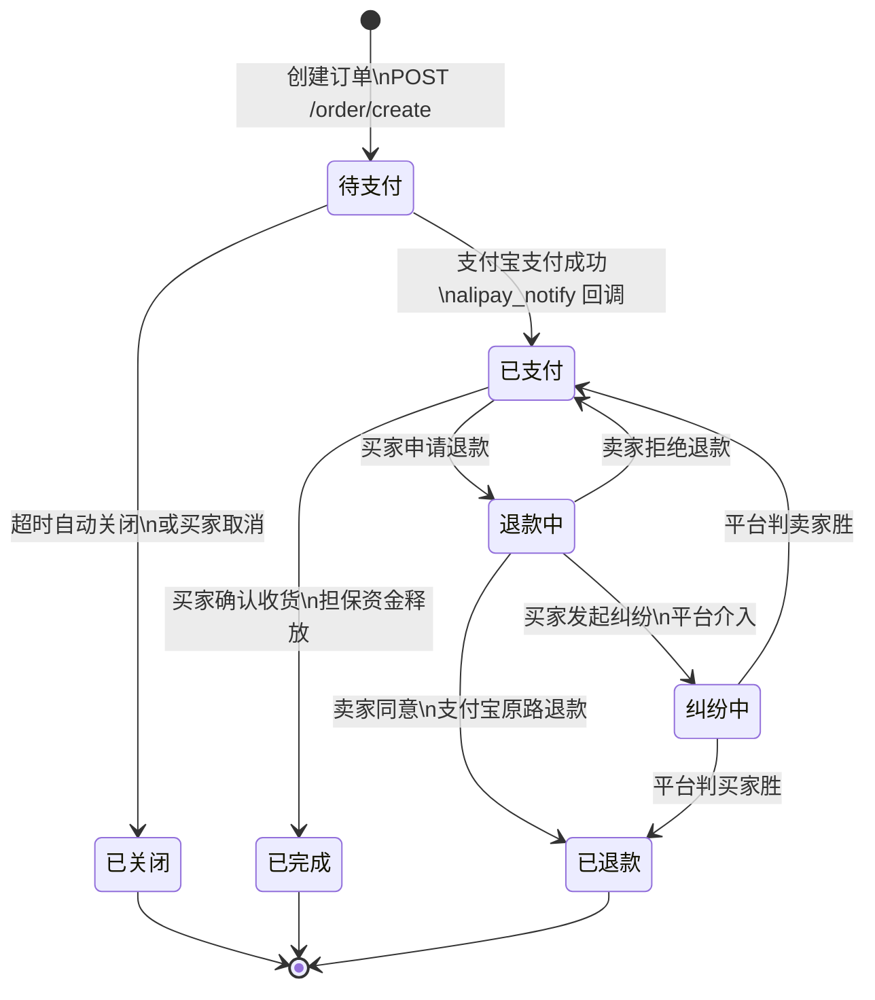

### 支付配置

卖家在「系统设置 → 支付配置」页面配置支付宝商户信息（`app_id`、`merchant_private_key`、`alipay_public_key`），配置存储于 MongoDB，支持连通性测试。

### 数据库表

| 表名 | 说明 |
|------|------|
| `orders` | 订单主表，字段：`order_no`、`user_id`、`mall_id`、`total_amount`、`status`（pending/paid/completed/closed/refund_pending/refunded/dispute）、`idempotency_key`、`version`（乐观锁） |
| `order_items` | 订单明细，字段：`order_id`、`shopping_id`、`name`、`spec`、`price`、`quantity`、`img` |
| `payment_transactions` | 支付流水，字段：`transaction_no`、`order_no`、`method`、`amount`、`status`（pending/paid/refunded/failed）、`alipay_trade_no` |
| `escrow_account` | 担保账户，字段：`order_no`、`mall_id`、`amount`、`status`（held/released/refunded）、`released_at` |
| `refund_requests` | 退款申请，字段：`refund_no`、`order_no`、`user_id`、`mall_id`、`amount`、`reason`、`status`（pending/seller_approved/seller_rejected/dispute/refunded/closed）、`arbitration_result` |

### API 端点

#### 买家端（订单）

| 接口 | 方法 | 路径 | 说明 |
|------|------|------|------|
| 创建订单 | POST | `/api/order/create` | 幂等键防重复，扣库存（乐观锁） |
| 发起支付 | POST | `/api/order/pay` | 返回支付宝支付表单 HTML |
| 支付回调 | POST | `/api/order/alipay_notify` | 支付宝异步通知，验签 + 更新状态 + 入担保 |
| 支付跳转 | GET | `/api/order/alipay_return` | 支付后同步跳转前端 |
| 同步支付 | POST | `/api/order/sync_pay` | 前端主动查询支付宝交易状态 |
| 取消订单 | POST | `/api/order/cancel` | 取消待支付订单，回滚库存 |
| 确认收货 | POST | `/api/order/confirm` | 确认收货，释放担保资金 |
| 订单退款 | POST | `/api/order/refund` | 直接支付宝全额退款（简易流程） |
| 订单列表 | GET | `/api/order/list` | 买家订单列表（状态筛选、分页） |
| 订单详情 | GET | `/api/order/detail` | 订单详情（含流水、担保信息） |

#### 买家端（退款申请）

| 接口 | 方法 | 路径 | 说明 |
|------|------|------|------|
| 申请退款 | POST | `/api/refund/apply` | 提交退款申请（进入卖家审核） |
| 发起纠纷 | POST | `/api/refund/dispute` | 卖家拒绝后，买家申请平台介入 |
| 退款详情 | GET | `/api/refund/detail` | 按退款单号查询详情 |
| 按订单查退款 | GET | `/api/refund/by_order` | 按订单号查最近退款信息 |

#### 卖家端

| 接口 | 方法 | 路径 | 说明 |
|------|------|------|------|
| 订单列表 | GET | `/api/seller/order/list` | 卖家端订单列表（状态/关键词筛选） |
| 资金明细 | GET | `/api/seller/order/escrow_list` | 担保账户流水 |
| 退款列表 | GET | `/api/seller/order/refund_list` | 退款申请列表 |
| 退款审核 | POST | `/api/seller/order/refund_review` | 同意或拒绝退款 |
| 支付配置保存 | POST | `/api/buyer_pay_config` | 保存支付宝配置（存 MongoDB） |
| 支付配置查询 | GET | `/api/buyer_pay_config` | 查询配置（私钥脱敏） |
| 配置连通测试 | POST | `/api/buyer_pay_config/verify` | 校验支付宝密钥有效性 |

#### 平台端（纠纷管理）

| 接口 | 方法 | 路径 | 说明 |
|------|------|------|------|
| 纠纷列表 | GET | `/api/manage/refund/list` | 平台纠纷/退款列表（权限 `admin.refund`） |
| 退款详情 | GET | `/api/manage/refund/detail` | 平台查看退款详情 |
| 仲裁处理 | POST | `/api/manage/refund/resolve` | 平台仲裁（判买家胜/卖家胜） |

## 📊 卖家仪表盘

卖家端首页集成了数据看板，展示店铺经营概况，支持按时间范围筛选（周/月/季/年），并可导出 CSV 营业报表。

### 看板模块

| 模块 | 展示内容 |
|------|----------|
| **数据卡片** | 在售商品数、订单数、销售总额、待处理退款数 |
| **饼图** | 订单状态分布（待支付/已支付/已完成/已关闭/退款中/已退款） |
| **折线图** | 日销售额趋势 |
| **最近订单** | 最新订单列表（订单号、商品、买家、金额、状态、时间） |

### API 端点

| 接口 | 方法 | 路径 | 说明 |
|------|------|------|------|
| 仪表盘数据 | GET | `/api/seller/dashboard/summary` | 聚合卡片、饼图、趋势、最近订单 |
| 导出报表 | GET | `/api/seller/dashboard/export` | 下载 CSV 营业报表（UTF-8 BOM） |

参数 `period` 可选值：`week`（本周）、`month`（本月）、`three_months`（近三月）、`year`（本年）。

## 🧪 常用开发命令

### 前端（`porject/`）

- `npm run dev`：本地开发
- `npm run build`：类型检查 + 打包
- `npm run preview`：预览生产构建
- `npm run lint`：ESLint 自动修复
- `npm run format`：格式化 `src/`

### 后端（`serve/`）

- `uv run uvicorn main:app --reload`：开发模式启动
- `uv run python -m services.recommend.wide_deep.train`：手动全量训练推荐模型

## 项目维护

- **许可证**: GPLv3
- **作者**: SDIJF1521
- **版本**: 0.9.0

## 🤝贡献指南

欢迎提交 Issue 和 Pull Request 来改进此项目。

## 🙏致谢

感谢所有为本项目做出贡献的人。
